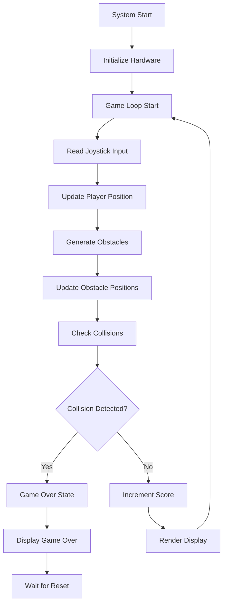

# 🎮 Dodge Falling Obstacles


---
> Click the button below to jump straight into my project.

<p align="center">
  <a href="https://wokwi.com/projects/438789175481981953" target="_blank">
    
  </a>
</p>
<br>

- [🔗
My project](https://wokwi.com/projects/438789175481981953)

``` bash
https://wokwi.com/projects/438789175481981953

```


## 📋 Project Overview

This project is an **embedded game** built using a Raspberry Pi Pico microcontroller. The player controls a character using a joystick on an OLED display, dodging randomly falling obstacles. The game features real-time scoring, collision detection, and an engaging gameplay experience perfect for demonstrating embedded systems capabilities.

### 🎯 Core Gameplay
- **Player Control:** Move in four directions using analog joystick
- **Obstacle Avoidance:** Dodge falling blocks to survive
- **Progressive Scoring:** Score increases the longer you survive
- **Collision Detection:** Game ends when player hits an obstacle

---

## ✨ Features

| Feature              | Status      | Description                 |
|----------------------|------------|-----------------------------|
| ✅ Joystick Control  | Implemented| Smooth analog movement      |
| ✅ Random Obstacles  | Working    | Dynamic obstacle generation |
| ✅ Real-time Scoring | Active     | Continuous score increment  |
| ✅ Collision Detection| Functional | Pixel-perfect collision     |
| ✅ OLED Display      | Integrated | 128×64 pixel graphics       |
| ✅ Game States       | Complete   | Active/Game Over states     |

---

## 🛠️ Hardware Components

### 📋 Bill of Materials

| Component            | Quantity | Specifications         | Purpose          |
|----------------------|----------|-----------------------|------------------|
| Raspberry Pi Pico    | 1        | RP2040 Microcontroller| Game Processor   |
| OLED Display         | 1        | 128×64, I2C Interface | Visual Output    |
| Joystick Module      | 1        | Analog X/Y + Button   | Player Input     |
| Breadboard           | 1        | 400 points            | Prototyping      |
| Jumper Wires         | 10+      | Various lengths       | Connections      |
| Micro-USB Cable      | 1        | Power/Programming     | System Power     |

### 🔌 Circuit Diagram

```
🎮 JOYSTICK MODULE
VRx (X-axis) → GP26 (ADC0)
VRy (Y-axis) → GP27 (ADC1)
SW (Button) → (Optional) GP any
VCC → 3.3V
GND → GND

📺 OLED DISPLAY (I2C)
SDA → GP0
SCL → GP1
VCC → 3.3V
GND → GND
```

---

## ⚙️ Working Principle

### 🔄 Game Architecture



### 🎮 Control Mechanics

- **X-axis:** Left/Right movement
- **Y-axis:** Up/Down movement
- **Boundary Detection:** Prevents moving off-screen
- **Movement Speed:** Balanced for responsive gameplay

### 🎯 Game Elements

| Element    | Size     | Behavior                  | Notes               |
|------------|----------|--------------------------|---------------------|
| Player     | 8×8 px   | Controlled by joystick   | Centered bottom start|
| Obstacles  | 8×8 px   | Fall from top at 2px/frame| Random X positions  |
| Score      | Text     | Increments each frame    | Top-left corner     |

---

## 🎯 Game Specifications

| Parameter         | Value       | Description                 |
|-------------------|------------|-----------------------------|
| Display Resolution| 128×64     | OLED pixel dimensions       |
| Frame Rate        | ~20 FPS    | Smooth gameplay             |
| Player Speed      | 2 px/frame | Responsive movement         |
| Obstacle Speed    | 2 px/frame | Challenging pace            |
| Spawn Rate        | 1 in 20    | Balanced difficulty         |

---

## 🚀 Installation & Setup

### 📋 Required Libraries

```python
# Save as requirements.txt
micropython-ssd1306
```

### 🔧 Hardware Setup Steps

1. **Connect OLED Display** to I2C pins (GP0, GP1)
2. **Connect Joystick** to analog pins (GP26, GP27)
3. **Upload code** to Raspberry Pi Pico
4. **Power on** and enjoy the game!

### 🎮 Calibration Tips

- Adjust `movement_speed` for different control sensitivity
- Modify `obstacle_spawn_rate` for difficulty adjustment
- Change `game_speed` for faster/slower gameplay

---

## 🌟 Advanced Features & Enhancements

### 🚀 Planned Improvements

| Feature           | Status   | Description                |
|-------------------|----------|----------------------------|
| Multiple Lives    | 🔄 Planned| 3 lives before game over   |
| Power-ups         | 💡 Idea  | Temporary invincibility    |
| High Score Saving | 🔄 Planned| EEPROM storage             |
| Sound Effects     | 💡 Idea  | Buzzer for audio feedback  |
| Level Progression | 💡 Idea  | Increasing difficulty      |

### 🎨 Visual Enhancements

- **Animated sprites** instead of blocks
- **Particle effects** on collisions
- **Background graphics** for better visuals
- **Smooth animations** for movements

---

## 🎓 Educational Value

This project demonstrates key embedded systems concepts:

### 🏗️ Hardware Integration

- **Analog Input Processing** (Joystick ADC)
- **I2C Communication** (OLED Display)
- **Real-time Graphics** rendering
- **Input/Output** synchronization

### 💻 Software Development

- **Game Loop Architecture**
- **Collision Detection Algorithms**
- **State Management** (Game states)
- **Performance Optimization**

### 🎮 Game Development

- **Player Controls** and input handling
- **Object Management** (Obstacles)
- **Game Physics** and movement
- **User Interface** design

---

## 📊 Performance Optimization Tips

```python
# 💡 Optimization techniques used:

# 1. Efficient collision detection
# 2. Object pooling for obstacles
# 3. Minimal display updates
# 4. Optimized rendering pipeline
```

---


## 🤝 Contributing

We welcome contributions to enhance this embedded game:
- New game features and mechanics
- Performance optimizations
- Additional hardware support
- Documentation improvements

---


**⭐ If you enjoy this embedded game, please give it a star on GitHub!**


*Keep Dodging!* 🎯

